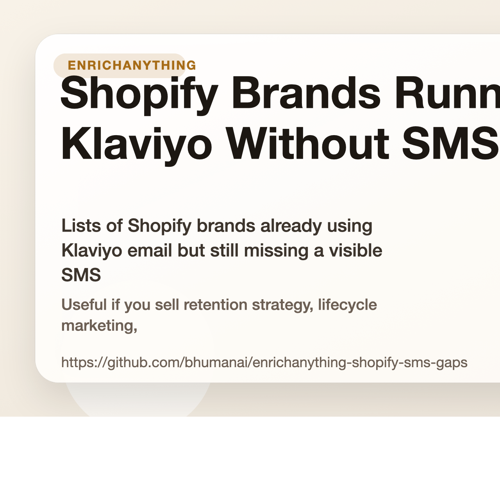

# Shopify Brands Running Klaviyo Without SMS

Lists of Shopify brands already using Klaviyo email but still missing a visible SMS layer.

Useful if you sell retention strategy, lifecycle marketing, or SMS setup for ecommerce brands.

## Start here

- Fastest first click: [Shopify brands in France using Klaviyo but not SMS tooling dataset](https://www.enrichanything.com/datasets/markets/shopify-france-klaviyo-no-sms?utm_source=github&utm_medium=public_repo&utm_campaign=enrichanything-shopify-sms-gaps&utm_content=market-shopify-france-klaviyo-no-sms-dataset) (live)
- Stable link: [Shopify brands in France using Klaviyo but not SMS tooling snapshot](https://www.enrichanything.com/snapshots/markets/shopify-france-klaviyo-no-sms/2026-03-27-b4d4422768?utm_source=github&utm_medium=public_repo&utm_campaign=enrichanything-shopify-sms-gaps&utm_content=market-shopify-france-klaviyo-no-sms-snapshot)
- Matching note: [French Shopify brands still leave SMS out of an otherwise mature Klaviyo stack dataset](https://www.enrichanything.com/datasets/reports/france-klaviyo-sms-gap?utm_source=github&utm_medium=public_repo&utm_campaign=enrichanything-shopify-sms-gaps&utm_content=report-france-klaviyo-sms-gap-dataset)
- Cleaner web version: [https://bhumanai.github.io/enrichanything-shopify-sms-gaps/](https://bhumanai.github.io/enrichanything-shopify-sms-gaps/)
- Full product: [EnrichAnything](https://www.enrichanything.com/?utm_source=github&utm_medium=public_repo&utm_campaign=enrichanything-shopify-sms-gaps&utm_content=repo-home)

- Source product: https://www.enrichanything.com
- GitHub repo: https://github.com/bhumanai/enrichanything-shopify-sms-gaps
- Dataset hub: https://www.enrichanything.com/datasets/
- Public API docs: https://www.enrichanything.com/api/
- OpenAPI spec: https://www.enrichanything.com/openapi.json
- Last refresh: April 13, 2026
- Refresh command: `npm run refresh`

## Developer links

- Dataset hub: [EnrichAnything datasets](https://www.enrichanything.com/datasets/)
- Public API docs: [EnrichAnything API](https://www.enrichanything.com/api/)
- Node SDK repo: [enrichanything-public-api-node](https://github.com/bhumanai/enrichanything-public-api-node)
- Python SDK repo: [enrichanything-public-api-python](https://github.com/bhumanai/enrichanything-public-api-python)

## Use this repo if...

- Lifecycle agencies: Lead with stack completion. These brands already care about retention enough to run Klaviyo, so the pitch is about adding SMS, not teaching them email. Start with [Shopify brands in France using Klaviyo but not SMS tooling](https://www.enrichanything.com/datasets/markets/shopify-france-klaviyo-no-sms?utm_source=github&utm_medium=public_repo&utm_campaign=enrichanything-shopify-sms-gaps&utm_content=market-shopify-france-klaviyo-no-sms-dataset) (live).
- SMS specialists: Use this when you want brands with obvious owned-channel maturity but a missing SMS layer you can point to immediately. Start with [Shopify brands in Germany using Klaviyo but not SMS tooling](https://www.enrichanything.com/datasets/markets/shopify-germany-klaviyo-no-sms?utm_source=github&utm_medium=public_repo&utm_campaign=enrichanything-shopify-sms-gaps&utm_content=market-shopify-germany-klaviyo-no-sms-dataset) (live).
- Retention freelancers: Start with the live lists, validate the pop-up and flows manually, then pitch the missing channel as the next retention win. Start with [Shopify brands in France using Klaviyo but not SMS tooling](https://www.enrichanything.com/datasets/markets/shopify-france-klaviyo-no-sms?utm_source=github&utm_medium=public_repo&utm_campaign=enrichanything-shopify-sms-gaps&utm_content=market-shopify-france-klaviyo-no-sms-dataset) (live).

## Lists you can use now

| List | Status | Rows | Dataset | Live list |
| --- | --- | ---: | --- | --- |
| [Shopify brands in France using Klaviyo but not SMS tooling](markets/shopify-france-klaviyo-no-sms/README.md) | live | 20 | [Dataset](https://www.enrichanything.com/datasets/markets/shopify-france-klaviyo-no-sms?utm_source=github&utm_medium=public_repo&utm_campaign=enrichanything-shopify-sms-gaps&utm_content=market-shopify-france-klaviyo-no-sms-dataset) | [Live list](https://www.enrichanything.com/markets/shopify-france-klaviyo-no-sms?utm_source=github&utm_medium=public_repo&utm_campaign=enrichanything-shopify-sms-gaps&utm_content=market-shopify-france-klaviyo-no-sms) |
| [Shopify brands in Germany using Klaviyo but not SMS tooling](markets/shopify-germany-klaviyo-no-sms/README.md) | live | 20 | [Dataset](https://www.enrichanything.com/datasets/markets/shopify-germany-klaviyo-no-sms?utm_source=github&utm_medium=public_repo&utm_campaign=enrichanything-shopify-sms-gaps&utm_content=market-shopify-germany-klaviyo-no-sms-dataset) | [Live list](https://www.enrichanything.com/markets/shopify-germany-klaviyo-no-sms?utm_source=github&utm_medium=public_repo&utm_campaign=enrichanything-shopify-sms-gaps&utm_content=market-shopify-germany-klaviyo-no-sms) |

## Notes that explain the market

| Note | Status | Rows | Dataset | Source note |
| --- | --- | ---: | --- | --- |
| [French Shopify brands still leave SMS out of an otherwise mature Klaviyo stack](reports/france-klaviyo-sms-gap/README.md) | live | 20 | [Dataset](https://www.enrichanything.com/datasets/reports/france-klaviyo-sms-gap?utm_source=github&utm_medium=public_repo&utm_campaign=enrichanything-shopify-sms-gaps&utm_content=report-france-klaviyo-sms-gap-dataset) | [Source note](https://www.enrichanything.com/reports/france-klaviyo-sms-gap?utm_source=github&utm_medium=public_repo&utm_campaign=enrichanything-shopify-sms-gaps&utm_content=report-france-klaviyo-sms-gap) |
| [German Shopify brands still leave SMS out of an otherwise mature Klaviyo stack](reports/germany-klaviyo-sms-gap/README.md) | live | 20 | [Dataset](https://www.enrichanything.com/datasets/reports/germany-klaviyo-sms-gap?utm_source=github&utm_medium=public_repo&utm_campaign=enrichanything-shopify-sms-gaps&utm_content=report-germany-klaviyo-sms-gap-dataset) | [Source note](https://www.enrichanything.com/reports/germany-klaviyo-sms-gap?utm_source=github&utm_medium=public_repo&utm_campaign=enrichanything-shopify-sms-gaps&utm_content=report-germany-klaviyo-sms-gap) |

## Need a custom cut?

Open [EnrichAnything](https://www.enrichanything.com/?utm_source=github&utm_medium=public_repo&utm_campaign=enrichanything-shopify-sms-gaps&utm_content=repo-home) if you want more columns, a fresh export, or the same pattern for a different niche.
